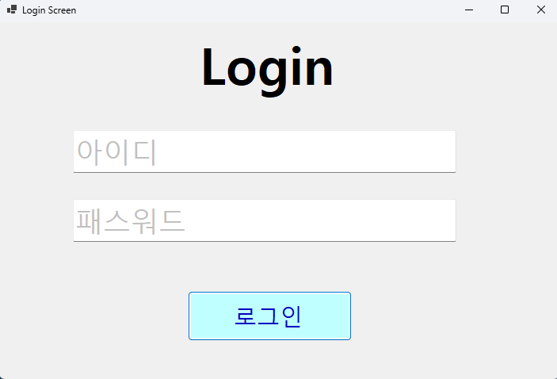
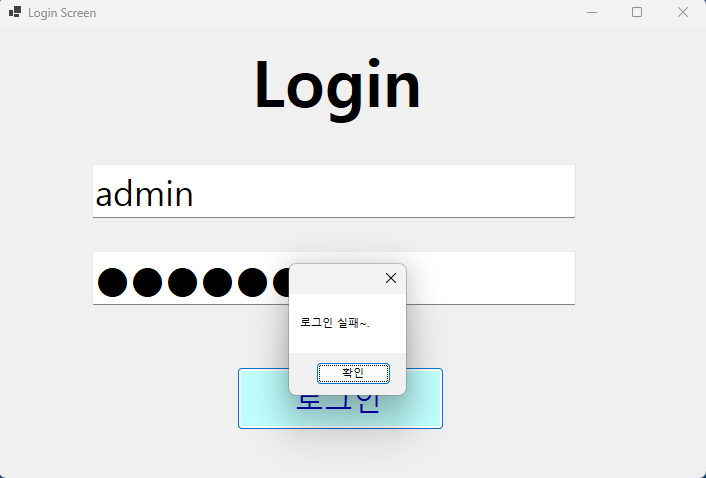
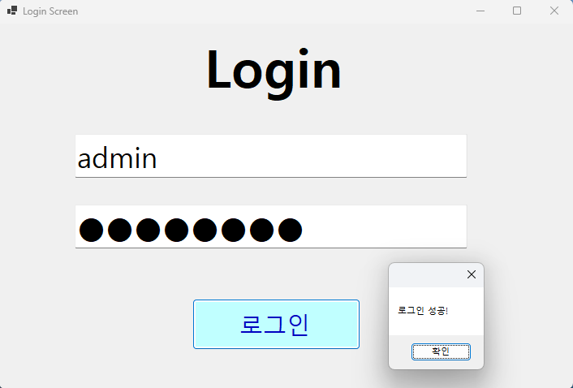
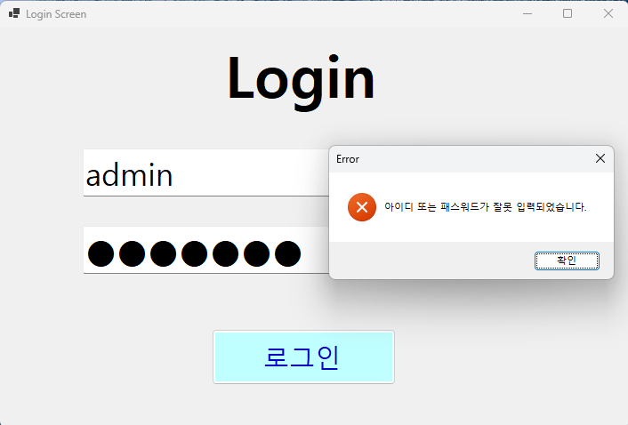
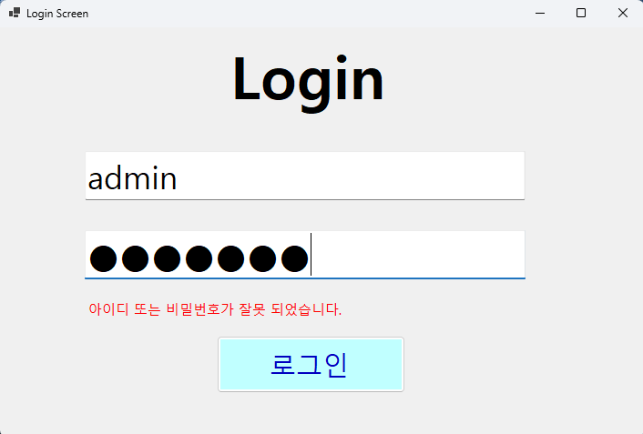

# (C# 코딩) 로그인 스크린

## 개요
- C# 프로그래밍 학습
- 1줄 소개: 사용자의 아이디와 패스워드를 입력받는 로그인 화면
- 사용한 플랫폼: 
	- C#, .NET Windows Forms, Visual Studio, GitHub
- 사용한 컨트롤:
	- Label, TextBox, Button
- 사용한 기술과 구현한 기능:	
	- Visual Studio를 이용하여 UI 디자인
	- 패스워드 입력 내용을 숨기는 기능 구현
	- Placeholder 기능 구현
	- 탭을 이용한 입력 포커스 제어
	- MessageBox를 이용한 로그인 결과 메시지 출력
	- Lable의 Visible 속성을 이용하여 로그인 실패 메시지 출력 제어
	- KeyDown 이벤트를 이용하여 Enter 키로 로그인 시도 기능 구현

## 실행 화면 (과제1)
- 과제1 코드의 실행 스크린샷

- 과제 내용
	- Lable(표시), TextBox(입력), Button(전송)을 적절히 배치합니다
	- TextBox에 Placeholder 기능 구현합니다
	- 아이디와 패스워드 입력 받아 확인합니다
- 구현 내용과 기능 설명
	- 처음 실행시 입력 포커스가 버튼으로 가도록 조정
	- 아이디와 패스워드를 입력 받는 창에는 안내 문구가 표시되도록 구현
	- 입력문구는 회색으로 표시되고, 입력이 시작되면 사라지도록 구현
	- 패스워드를 남이 보지 못하도록 입력 내용을 숨기는 기능 구현
	- 아이디와 패스워드가 모두 맞게 입력되면 "로그인 성공" 메시지 출력, 그렇지 않으면 "로그인 실패" 메시지 출력

- 과제2 코드의 실행 스크린샷

- 과제 내용
	- MessageBox를 이용하여 로그인 결과 메시지 출력
	- 로그인 실패시 MessageBox 대신 Label을 이용하여 로그인 실패 메시지 출력
	- Enter 키를 이용하여 로그인 시도할 수 있도록 구현
- 구현 내용
	- 로그인 결과 메시지를 MessageBox로 출력하도록 구현
	- Lable을 Invisible로 설정하여 로그인 실패시에만 보이도록 설정
	- Enter 키를 누르면 아이디 입력창에서 패스워드 입력창으로, 패스워드 입력창에서는 로그인 시도하도록 Form의 KeyDown 이벤트에 메서드 연결

## 배운 내용
	-
	-